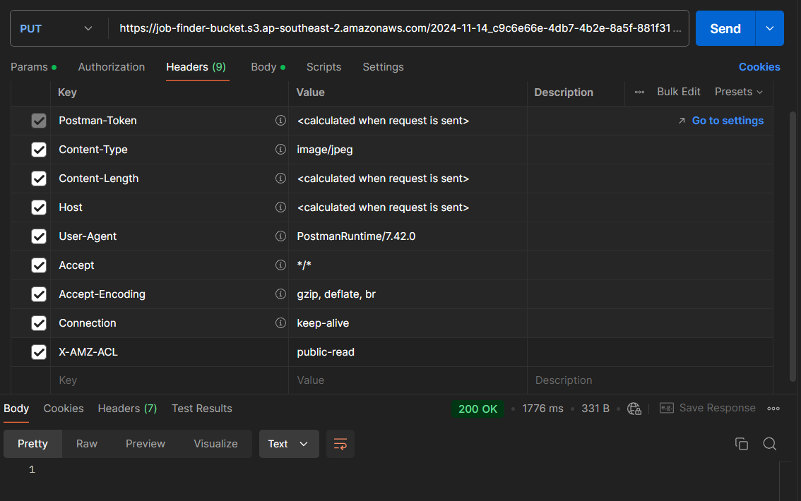
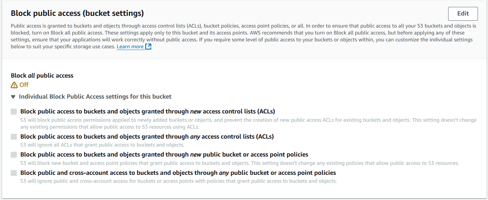
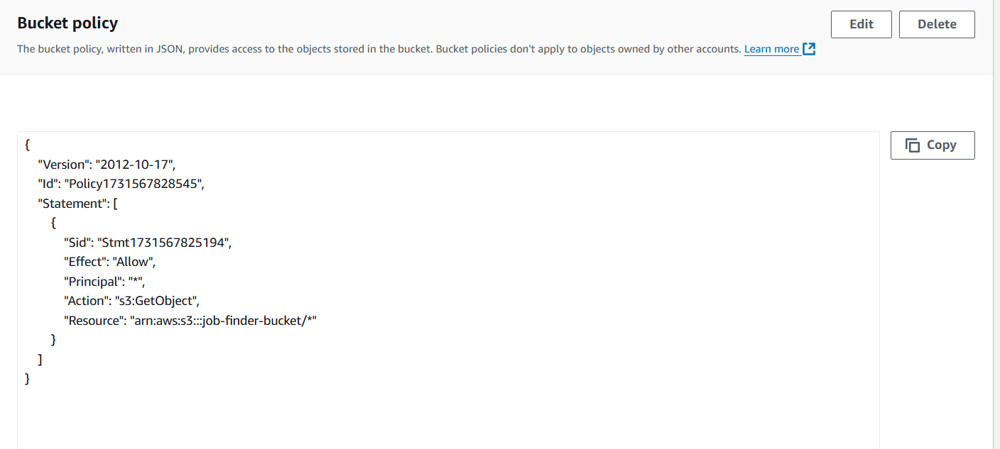
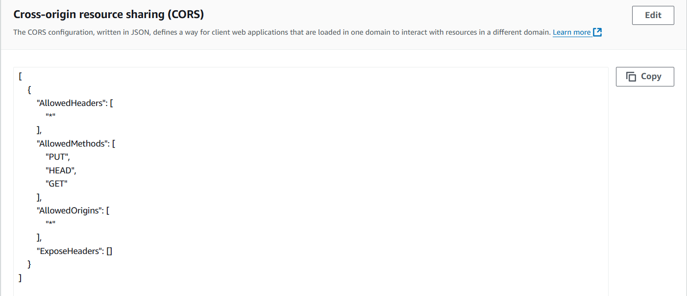

# Job-Finder-SpringBoot

## Lưu ý khi sử dụng Presigned Url để up file lên S3
- Đảm bảo Bucket bật Access Control List (ACL), User được gán các policies: **GetObjectAcl**, **PutObjectACL**
- Set Bucket Policy, CORS
- Hàm tạo Presigned Url:
  ```
  private String generatePutPresignedUrl(String filePath) {
      PutObjectRequest.Builder putObjectRequestBuilder =
      PutObjectRequest.builder().bucket(awsProperties.getS3BucketName()).key(filePath);

      putObjectRequestBuilder.acl(ObjectCannedACL.PUBLIC_READ);

      PutObjectRequest putObjectRequest = putObjectRequestBuilder.build();

      PutObjectPresignRequest presignRequest =
      PutObjectPresignRequest.builder()
      .signatureDuration(Duration.ofMinutes(60))
      .putObjectRequest(putObjectRequest)
      .build();

      PresignedPutObjectRequest presignedRequest = s3Presigner.presignPutObject(presignRequest);
      return presignedRequest.url().toString();
  }
  ```
- Request PUT để up file lên S3 thêm Header: **X-AMZ-ACL:public-read**
  
  
  
  